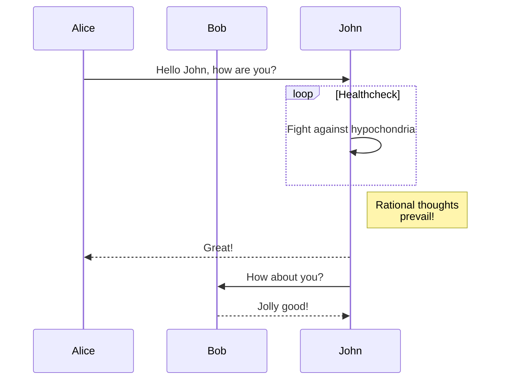

Lorem ipsum dolor sit amet, consectetur adipiscing elit. Pellentesque ullamcorper placerat erat eu luctus. Nulla ultricies dui lacus, id aliquet sem ultrices euismod. Aliquam erat tellus, convallis non nunc in, iaculis posuere felis. Aliquam maximus dictum urna nec viverra. Curabitur vel ipsum condimentum, mattis purus at, consequat ante. Aliquam erat volutpat. Donec eget scelerisque nibh. Maecenas id diam nunc. Donec in felis volutpat, lobortis velit quis, pharetra orci.

Morbi in purus vel est rutrum eleifend. Sed ultricies lectus in molestie maximus. Vestibulum ante ipsum primis in faucibus orci luctus et ultrices posuere cubilia curae; Donec elementum, tellus a iaculis ullamcorper, massa arcu varius purus, eget lacinia purus magna facilisis nisl. Pellentesque bibendum velit neque, sed dictum leo tristique in. In molestie arcu et eros consectetur rutrum. Class aptent taciti sociosqu ad litora torquent per conubia nostra, per inceptos himenaeos. Sed consequat id erat vel finibus. Suspendisse tempor egestas metus, sed congue nunc. Nulla facilisi. Cras vitae orci sit amet arcu molestie interdum ut nec erat. Maecenas ullamcorper libero nisl, quis volutpat lectus varius ut.

Donec imperdiet neque vitae est finibus placerat. Orci varius natoque penatibus et magnis dis parturient montes, nascetur ridiculus mus. Cras sed massa euismod purus dictum lobortis. Pellentesque interdum nisl vitae dignissim venenatis. Morbi lobortis dui vel pulvinar accumsan. Nam a arcu non lorem placerat feugiat mattis non nulla. Pellentesque porttitor, leo congue congue hendrerit, sem magna rhoncus ligula, nec scelerisque sapien sem vitae turpis. Donec vulputate purus felis, convallis congue odio iaculis nec. Curabitur pretium a neque euismod vehicula. Morbi ac vulputate nibh. Phasellus a bibendum turpis. Nam ut sapien vulputate, aliquam tellus nec, consectetur erat. Duis quis maximus orci. Praesent sapien quam, ornare eget turpis et, ultricies volutpat sapien. Ut volutpat et massa et vestibulum. Sed cursus tincidunt bibendum.

Mauris placerat, ipsum sed consectetur finibus, risus ligula lacinia ipsum, sed dapibus turpis massa at enim. Sed eu aliquet eros, sed aliquam lectus. Donec sem odio, aliquam id hendrerit ac, commodo nec tortor. Donec metus risus, tristique et odio pretium, ornare posuere odio. Quisque a elit magna. Aenean porttitor lectus est, at blandit neque scelerisque ultricies. Praesent dui lectus, dictum et pharetra a, efficitur et quam. Sed fermentum sodales libero, commodo tempor urna malesuada eget. Pellentesque scelerisque ligula at turpis condimentum mattis.

Nullam vitae tincidunt lectus. Sed fringilla neque a neque pretium, vitae dignissim neque pharetra. Vestibulum sed imperdiet metus, a pharetra libero. Nunc laoreet quis dolor non iaculis. Mauris eu convallis felis. Curabitur semper sollicitudin dolor, ut fringilla orci lobortis ut. Phasellus feugiat nulla sit amet tellus tempus, sed elementum elit hendrerit. Cras ac velit elit. Duis pellentesque non massa quis suscipit. Integer sit amet velit laoreet, faucibus felis sit amet, tincidunt elit. Class aptent taciti sociosqu ad litora torquent per conubia nostra, per inceptos himenaeos. Cras et felis tortor. 





# H1
## H2
### H3
#### H4
##### H5
###### H6


# Formater

Emphasis, aka italics, with *asterisks* or _underscores_.

Strong emphasis, aka bold, with **asterisks** or __underscores__.

Combined emphasis with **asterisks and _underscores_**.

Strikethrough uses two tildes. ~~Scratch this.~~

Inline-style: 


# Listing

## ordered 

1. First ordered list item
2. Another item
1. Actual numbers don't matter, just that it's a number
4. And another item.


## unordered

* Unordered list can use asterisks
* Or minuses
* Or pluses


# link


URLs and URLs in angle brackets will automatically get turned into links. 
http://www.example.com or <http://www.example.com> and sometimes 
example.com (but not on Github, for example).

Some text to show that the reference links can follow later.

[arbitrary case-insensitive reference text]: https://www.mozilla.org
[1]: http://slashdot.org
[link text itself]: http://www.reddit.com


# Image

Here's our logo (hover to see the title text):

Inline-style: 


Reference-style: 
![alt text][logo]

[logo]: cover.jpg "Logo Title Text 2"


# Block Code

Inline `code` has `back-ticks around` it.


```javascript
var s = "JavaScript syntax highlighting";
alert(s);
```
 
```python
s = "Python syntax highlighting"
print s
```
 
```
No language indicated, so no syntax highlighting. 
But let's throw in a <b>tag</b>.
```


Inline-style: 


# Footnote

Here is a simple footnote[^1].

A footnote can also have multiple lines[^2].  

You can also use words, to fit your writing style more closely[^note].

[^1]: My reference.
[^2]: Every new line should be prefixed with 2 spaces.  
  This allows you to have a footnote with multiple lines.
[^note]:
    Named footnotes will still render with numbers instead of the text but allow easier identification and linking.  
    This footnote also has been made with a different syntax using 4 spaces for new lines.


# Table

| Tables        | Are           | Cool  |
| ------------- |:-------------:| -----:|
| col 3 is      | right-aligned | $1700 |
| col 2 is      | centered      |   $12 |
| zebra stripes | are neat      |    $1 |

There must be at least 3 dashes separating each header cell.
The outer pipes (|) are optional, and you don't need to make the 
raw Markdown line up prettily. You can also use inline Markdown.

Markdown | Less | Pretty
--- | --- | ---
*Still* | `renders` | **nicely**
1 | 2 | 3


# Blockquotes

> Blockquotes are very handy in email to emulate reply text.
> This line is part of the same quote.

Quote break.

> This is a very long line that will still be quoted properly when it wraps. Oh boy let's keep writing to make sure this is long enough to actually wrap for everyone. Oh, you can **Dalai Lama** 


# Lining

Three or more...

---
